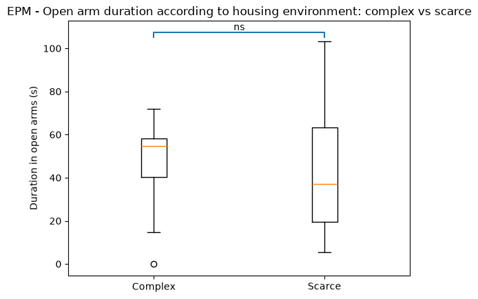
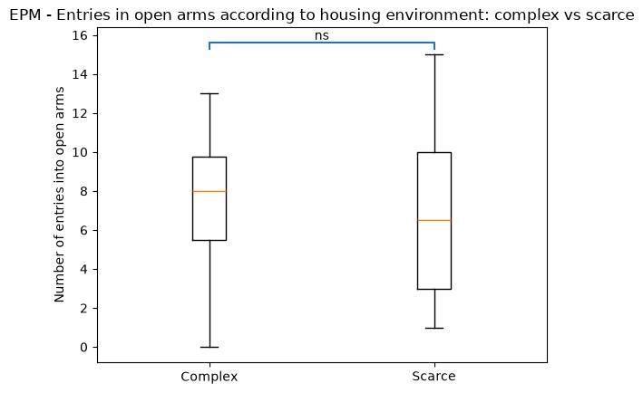
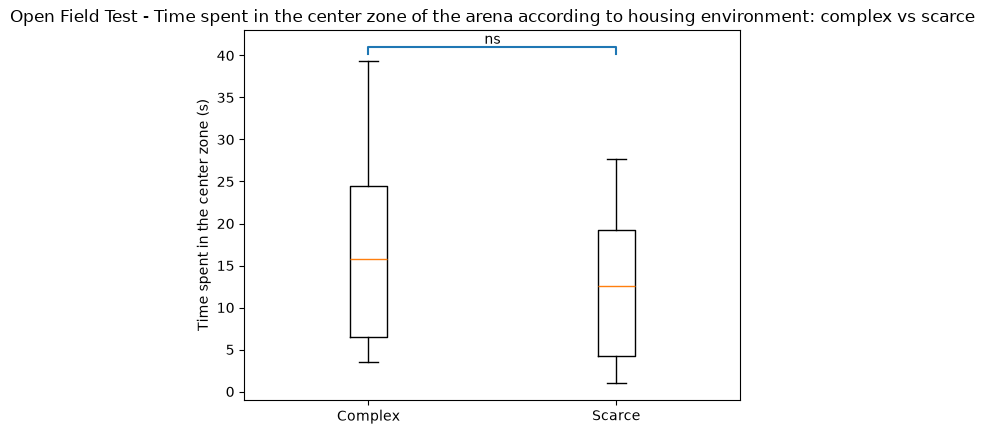
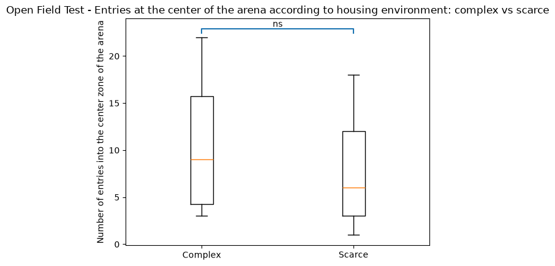
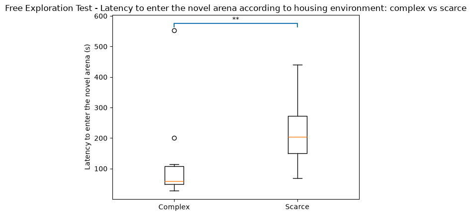
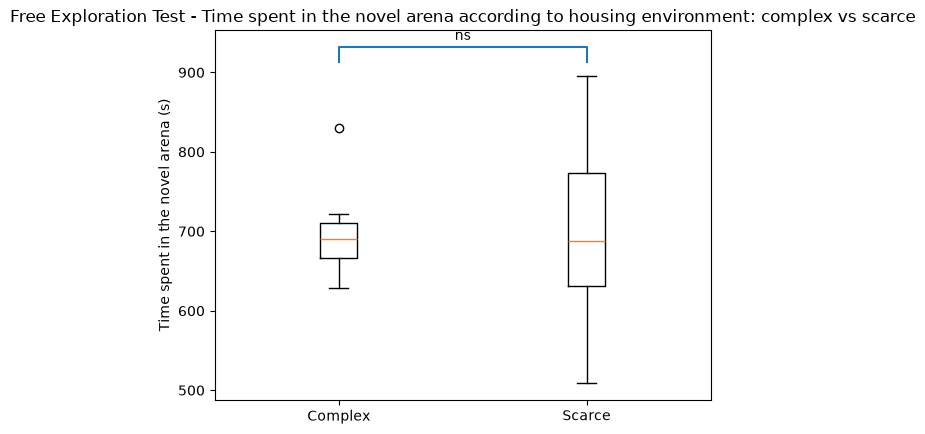

# Environmental Enrichment and Anxiety-Like Behavior in Female Mice

## Project Overview

This project investigates whether housing environment influences anxiety-like behavior in female B6D2F1N mice by comparing mice housed in complex and scarce environments.

Behavioral data from three commonly used tests were analyzed: the Elevated Plus Maze (EPM), Open Field Test (OFT), and Free Exploration Test (FET). Locomotor activity was assessed using distance-travelled variables, and touchscreen training status was also examined as a potential factor influencing behavioral outcomes.

The project was developed to practice Python for behavioral data analysis, including DataFrame manipulation with pandas, statistical analysis, data visualization, and the implementation of a complete data-analysis pipeline.

## Research Question

The primary objective is to determine whether environmental enrichment is associated with reduced anxiety-like behavior in female B6D2F1N mice.

A secondary objective is to determine whether this effect is consistently observed across multiple behavioral assays: the Elevated Plus Maze (EPM), Open Field Test (OFT), and Free Exploration Test (FET).

## Hypotheses

Mice housed in a complex environment were expected to display lower anxiety-like behavior than mice housed in a scarce environment.

The following directional hypotheses were tested:

- **Elevated Plus Maze (EPM):** mice from the complex environment were expected to spend more time in the open arms and enter them more frequently.
- **Open Field Test (OFT):** mice from the complex environment were expected to spend more time in the center zone and enter it more frequently.
- **Free Exploration Test (FET):** mice from the complex environment were expected to enter the novel arena sooner and spend more time in it.

For each assay, distance travelled was analyzed separately as a locomotor control variable, without a directional hypothesis.

## Dataset

The dataset used in this project comes from the study by Bračić et al. (2022), *"Once an optimist, always an optimist? Studying cognitive judgment bias in mice"*, published in Behavioral Ecology.

The original dataset includes female mice from two genotypes, C57BL/6J and B6D2F1N, housed under two environmental conditions: complex and scarce.

For this project, the analysis was restricted to B6D2F1N mice. Since all animals in the dataset were female, sex was held constant, reducing potential variability associated with sex and allowing a more focused investigation of housing environment.

The analysis focuses on behavioral variables obtained from three assays:
- Elevated Plus Maze (EPM)
- Open Field Test (OFT)
- Free Exploration Test (FET)

**Original dataset:** Bračić et al. (2022), Dryad  
**Dataset DOI:** https://doi.org/10.5061/dryad.2bvq83bsd  
**Original article:** https://doi.org/10.1093/beheco/arac040

## Behavioral Measures

Behavioral outcomes were assessed using three commonly used tests of anxiety-like and exploratory behavior.

| Assay | Behavioral variables | Locomotor control |
|---|---|---|
| **EPM** | Time spent in open arms; number of entries into open arms | Distance travelled |
| **OFT** | Time spent in center zone; number of entries into center zone | Distance travelled |
| **FET** | Latency to enter the novel arena; time spent in the novel arena | Distance travelled |

Higher open-arm exploration in the EPM and higher center-zone exploration in the OFT were interpreted as indicators of lower anxiety-like behavior. In the FET, shorter latency to enter and more time spent in the novel arena were interpreted as greater exploration of the novel environment.

Distance travelled was analyzed separately to assess whether differences in anxiety-related measures could be associated with differences in general locomotor activity.

## Analysis Workflow

The analysis was performed in Python and organized into the following steps:

### 1. Data acquisition

- Import of the behavioral dataset using pandas
- Public behavioral data were obtained from the original study dataset
- The raw file was preserved unchanged, and all analyses were performed on derived DataFrames

### 2. Dataset inspection

- Inspection of dataset structure, variables, and data types
- Identification of group categories

### 3. Data selection and cleaning

- Selection of B6D2F1N mice
- Selection of EPM, OFT, and FET variables
- Check for missing values, duplicates, and group sample sizes
- Exclusion of variables unrelated to the research question, such as learning-maze measures

### 4. Assay-specific analysis

- Creation of EPM, OFT, and FET DataFrames
- Calculation of descriptive statistics: mean, median, and standard deviation for each behavioral variable
- Comparison of complex and scarce housing groups
- Comparison of trained and non-trained mice for behavioral outcomes, independently of the primary complex vs. scarce comparison

### 5. Data visualization

- Creation of a function for statistical significance annotations
- Generation of boxplots using Matplotlib
- Export of figures for each behavioral assay

### 6. Interpretation

- Anxiety-related behavioral measures
- Locomotor control variables
- Cross-assay comparison
- Evaluation of the research question

## Statistical Approach

Statistical test selection was performed independently for each behavioral and locomotor variable.

Because of the relatively small group sizes, distributional assumptions were assessed before selecting the statistical test.

### Test selection

1. The **Shapiro-Wilk test** was applied separately to both groups.
   - If at least one group was not compatible with normality, a **Mann-Whitney U test** was used.
   - If both groups were compatible with normality, equality of variances was assessed using **Fisher's F-test**.

2. Based on Fisher's F-test:
   - Equal variances → **Student's t-test**
   - Unequal variances → **Welch's t-test**

A significance threshold of **α = 0.05** was used.

### Direction of the tests

For the primary comparison between complex and scarce environments, one-sided tests were used for anxiety-related variables according to the predefined biological hypotheses:

- **EPM:** complex > scarce for open-arm duration and entries
- **OFT:** complex > scarce for center duration and entries
- **FET:** complex < scarce for latency to enter the novel arena
- **FET:** complex > scarce for time spent in the novel arena

Distance-travelled variables were analyzed using two-sided tests because no directional difference in locomotor activity was predicted.

Trained and non-trained mice were also compared using two-sided tests to explore whether behavioral outcomes differed according to touchscreen training status.

This statistical decision process was implemented through reusable Python functions to automate test selection across behavioral variables.

## Results

### Elevated Plus Maze (EPM)

No statistically significant difference between complex and scarce housing groups was detected for:

- Time spent in the open arms (p = 0.513)
- Number of entries into the open arms (p = 0.370)
- Distance travelled (p = 0.249)

Therefore, the EPM results did not support the hypothesis of increased open-arm exploration in mice housed in the complex environment.

### Open Field Test (OFT)

No statistically significant difference between complex and scarce housing groups was detected for:

- Time spent in the center zone (p = 0.199)
- Number of entries into the center zone (p = 0.195)
- Distance travelled (p = 0.491)

Therefore, the OFT results did not provide evidence for increased center-zone exploration in the complex housing group.

### Free Exploration Test (FET)

Mice housed in the complex environment showed a significantly shorter latency to enter the novel arena compared with mice housed in the scarce environment (p = 0.0067).

No statistically significant difference was detected for:

- Time spent in the novel arena (p = 0.569)
- Distance travelled (p = 0.121)

The shorter latency is consistent with greater exploration of the novel environment in the complex housing group. The absence of a significant difference in distance travelled suggests that this result was not accompanied by a detectable difference in general locomotor activity.

### Touchscreen Training Status

Trained and non-trained mice were compared separately to investigate whether behavioral outcomes differed according to previous touchscreen training status.

Significant differences were detected for EPM measures:

- Open-arm duration (p = 0.0074)
- Open-arm entries (p = 0.0009)

Trained mice showed reduced open-arm exploration compared with non-trained mice.

No statistically significant differences between trained and non-trained mice were detected for the analyzed OFT or FET behavioral variables.

Additional locomotor-control and touchscreen-training figures are available in the `figures/` directory.

## Interpretation

Overall, the results provide limited support for the hypothesis that a complex housing environment is associated with reduced anxiety-like behavior in female B6D2F1N mice.

Among the six primary behavioral measures, only FET latency showed a statistically significant difference between housing conditions. Mice housed in the complex environment entered the novel arena sooner than mice housed in the scarce environment, which is consistent with increased exploratory behavior and reduced avoidance.

However, this pattern was not consistently observed across assays. No statistically significant housing-environment differences were detected for open-arm duration or entries in the EPM, center-zone duration or entries in the OFT, or time spent in the novel arena in the FET.

No significant differences in distance travelled were detected between complex and scarce groups in any of the three assays, suggesting that the observed behavioral results were not driven by detectable differences in locomotor activity.

The secondary analysis also showed that trained and non-trained mice differed significantly in EPM open-arm exploration. This suggests that touchscreen training status may be relevant when interpreting EPM outcomes, although its relationship with housing environment was not formally tested in this analysis.

## Limitations

Several limitations should be considered when interpreting these results:

- **Small sample size:** group sizes were relatively small, which may limit statistical power and the ability to detect subtle behavioral differences.

- **Cage-level dependence:** mice were housed in groups within cages. Observations from mice sharing the same cage may therefore not be fully independent, whereas the statistical tests used in this project treated individual mice as independent observations.

- **Touchscreen training status:** trained and non-trained mice differed significantly for some EPM measures. Training status may therefore represent a potential factor influencing behavioral outcomes. Its relationship with housing environment was not formally assessed in this analysis.

- **Multiple comparisons:** several behavioral variables were tested independently across the three assays without correction for multiple comparisons, increasing the risk of false-positive findings.

- **EPM variable selection:** raw open-arm duration and entry counts were analyzed, whereas the original study also used relative measures of open-arm exploration.

- **Secondary data analysis:** this project is based on an existing published dataset and was not designed as an independent experiment specifically addressing the present research question.

## Future Improvement

A future extension of this project would be to investigate the effect of housing environment while accounting for touchscreen training status. This would help determine whether the differences observed between trained and non-trained mice influence the interpretation of the complex vs. scarce housing comparison.